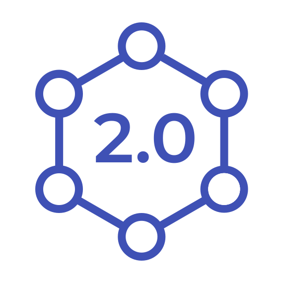
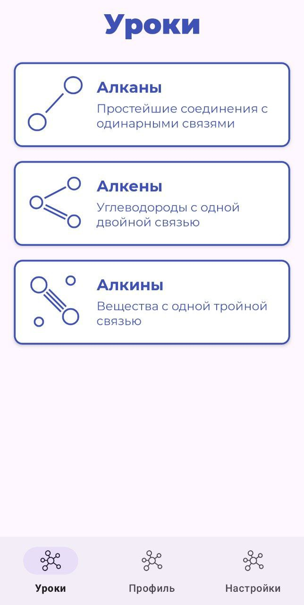
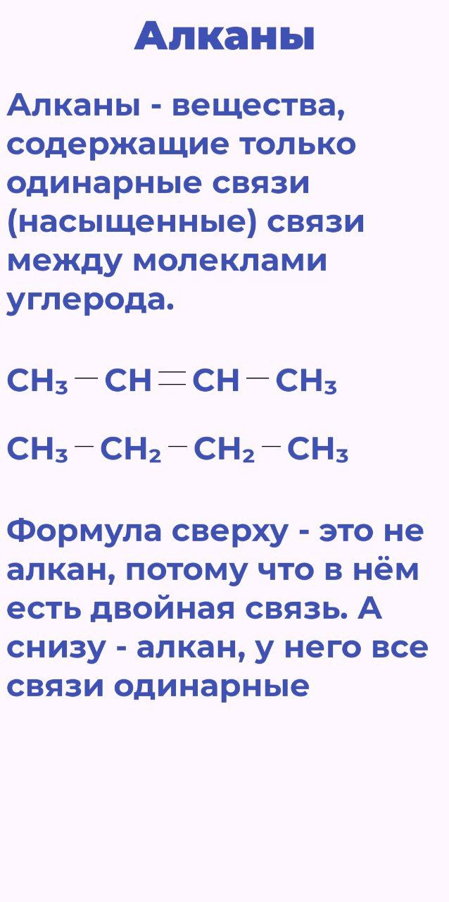
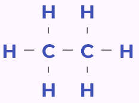

# Organica 2.0
### Приложение для изучения номенклатуры органических соединений

Учебный проект по разработке андроид-приложения для изучения номенклатуры органических соединений. Цель проекта - получить навыки разработки андроид-приложений.

**Статус:** В процессе разработки.

## Технологии  
- **Язык:** Kotlin  
- **Архитектура:** MVVM  
- **Библиотеки:**  
  - View Binding  
  - Moshi - для парсинга JSON  
  - LiveData - для передачи данных об уроке
  - Navigation Component

## Функциональность
### Главный экран
При открытии приложения происходит переход на экран `MainScreenActivity`, содержащий `FragmentContainerView`, настроенный для навигации между вкладками и панелью `BottomNavigationView` для навигации между фрагментами.

### Уроки
Каждый урок хранится в виде JSON-файла, содержащий текст и строковую интерпретацию струткурных формул, которые преобразуются в содержимое страницы.

Для отображения содержимого урока используется универсальный макет страницы, который наполняется содержимым динамически. Для парсинга JSON используется библиотека [Moshi](https://github.com/square/moshi). Содержимое страницы передаётся во `ViewModel` страницы в виде объекта `LiveData`, далее информация передаётся на макет. В итоге получаются страницы следующего вида:

### PlaceLayout
Кастомный `ViewGroup` для отрисовки структурных формул. Принимает расположение его дочерних элементов (узлов стуктурной формулы) друг относительно друга в виде строкового атрибута с помощью указания угла между элементами. Этот контейнер также рисует линии между элементами, которые представляют кратность связи между этими узлами. Так, с помощью `PlaceLayout` можно создавать такие формулы:

## Планы на дальнейшую разработку
- Завершить вкладки "Профиль" и "Настройки"
- Разработать интерактивные задания
- Расширить базу уроков